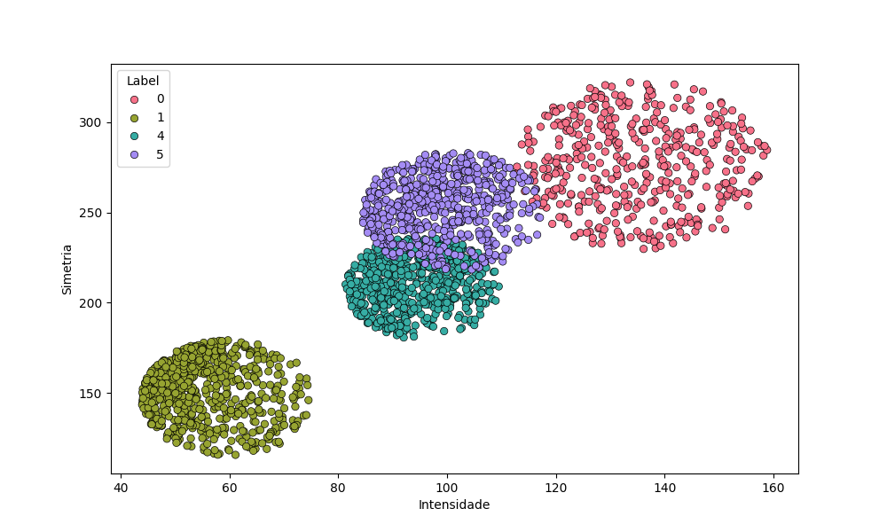

# **Mini-Projeto** - Reconhecimento de Dígitos
### Aluno: Thiago Rodrigues Cruz Justino
### Professores: Giberto Farias e Bruno Jefferson de Sousa

Inicialmente, é realizado o tratamento dos arquivos encontrados na pasta data, que contém [train_csv](data/train.csv) e [test_csv](data/train.csv). Esses arquivos possuem a primeira coluna como o rótulo (0, 1, 4 ou 5) e as 784 colunas restantes representando os valores dos pixels, que variam de 0 a 255. Para simplificar o problema, que originalmente possui 784 dimensões, são criadas duas novas colunas: simetria (a soma da simetria horizontal e vertical) e intensidade. Essas novas características são usadas no lugar dos valores dos pixels. Embora essa abordagem resulte em uma perda de informação, ela reduz a dimensionalidade do problema e o torna mais visualizável graficamente, uma vez que agora são utilizadas apenas duas "features". As novas tabelas foram salvos em [test_redu.csv](data/teste_redu.csv) e [train_redu.csv](data/train_redu.csv). Abaixo está uma imagem do gráfico que mostra as labels e seus respectivos pontos utilizando intensidade e simetria.

No arquivo [funcs.py](funcs.py)
 está presente os códigos de Regressão linear, PLA, Pocket e Regressão logistica. Abaixo estão os plots obtidos comparando 1 a 1 (no caso do PLA, nem sempre será possível ser utilizado, pois os dados não são linearmente separáveis). E importante destacar que foram feitas adapções como transformar as labels em 1 e -1 para conseguir calcular. Essas informações estão presentes no arquivo [codes.ipynb](codes.ipynb).

 
 
 
 
 