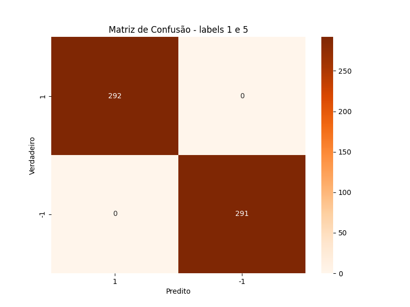
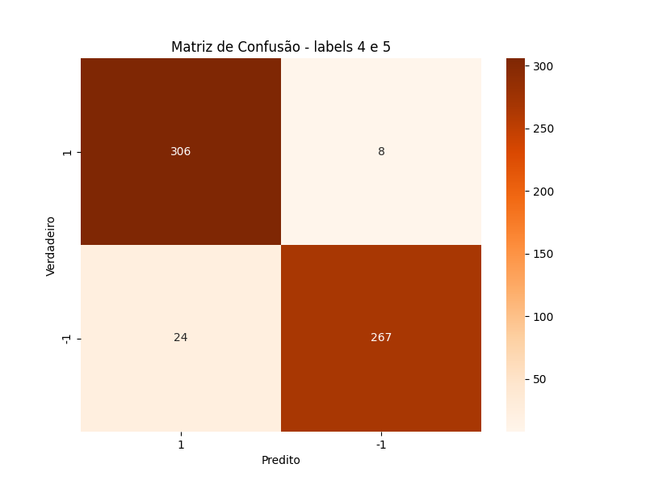
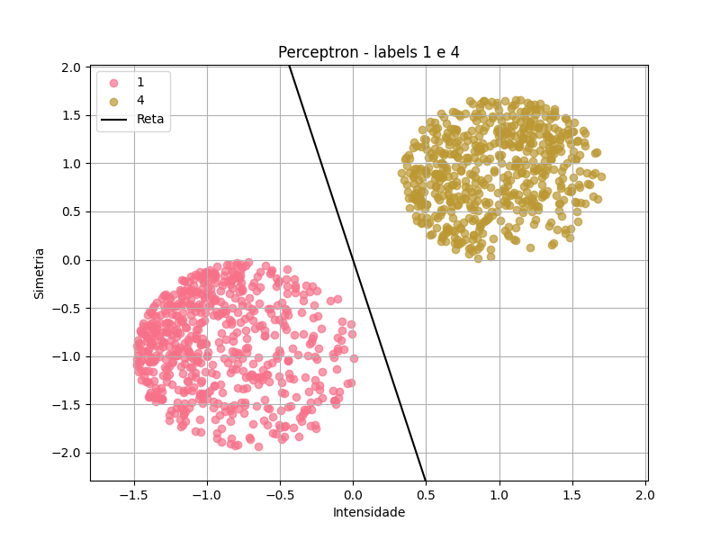
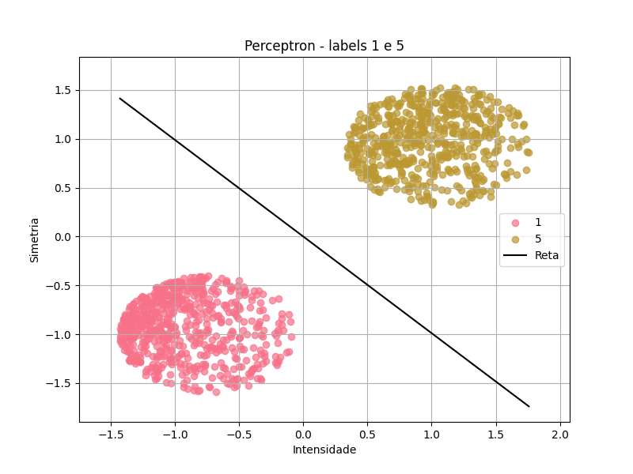
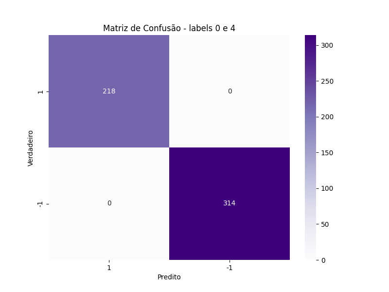

# **Mini-Projeto** - Reconhecimento de Dígitos
### Aluno: Thiago Rodrigues Cruz Justino
### Professores: Giberto Farias e Bruno Jefferson de Sousa

Inicialmente, é realizado o tratamento dos arquivos encontrados na pasta data, que contém [train.csv](data/train.csv) e [test.csv](data/train.csv). Esses arquivos possuem a primeira coluna como o rótulo (0, 1, 4 ou 5) e as 784 colunas restantes representando os valores dos pixels, que variam de 0 a 255. Para simplificar o problema, que originalmente possui 784 dimensões, são criadas duas novas colunas: simetria (a soma da simetria horizontal e vertical) e intensidade. Essas novas características são usadas no lugar dos valores dos pixels. Embora essa abordagem resulte em uma perda de informação, ela reduz a dimensionalidade do problema e o torna mais visualizável graficamente, uma vez que agora são utilizadas apenas duas "features". As novas tabelas foram salvos em [test_redu.csv](data/teste_redu.csv) e [train_redu.csv](data/train_redu.csv). Abaixo está uma imagem do gráfico que mostra as labels e seus respectivos pontos utilizando intensidade e simetria.
#### Plot dos dados:

No arquivo [funcs.py](funcs.py)
 está presente os códigos de Regressão linear, PLA, Pocket e Regressão logistica. Abaixo estão os plots obtidos comparando 1 a 1 (no caso do PLA, nem sempre será possível ser utilizado, pois os dados não são linearmente separáveis). E importante destacar que foram feitas adapções como transformar as labels em 1 e -1 para conseguir calcular. Essas informações estão presentes no arquivo [codes.ipynb](codes.ipynb).
O primeiro passo foi calcular e plotar gráficos de regressão linear, como é possível nos plots abaixo:
#### Plots - Regressão linear 1 x 1:
 
 
 
 
 
 
#### Matrizes confusão - Regressão Linear

 Feito isso, foi iniciado a análise 1 a 1 utilizando Perceptron. É importante destacar não é possível usar o Perceptron para todos os casos, pois nem sempre os dados eram linear separáveis. Uma adaptação feita com objetivo de melhorar o desempenho, foi iniciar o vetor W com os valores obtidos na regressão linear, isso  fez com que nem fossem feitas novas iterações em alguns casos(já que a reta já seperava os dados) e o processo todo fosse muito mais rápido. Obs: o primeiro exemplo não utilizou o W da regressão linear, justamente para ser visto a diferença; no número de iterações, ao utilizar o W obtido na regressão linear,  foi percebido que um número de iterações  milhares de vezes maior sem o W, e enxergar o comportamento da reta.
#### Plots - Perceptron 1 x 1:

#### Matrizes confusão Perceptron:

Para dados que são visualmente linearmente inseparáveis, foi usado o Pocket, que possui uma ideia similar ao Perceptron com a mudança que possui um número de iterações definido previamente.

### Visualização da Regressão Logística

[Labels 0,1](3D_plots/logistic_regression_3d_plot_0_1.html) |
[Labels 0,4](3D_plots/logistic_regression_3d_plot_0_4.html) |
[Labels 0,5](3D_plots/logistic_regression_3d_plot_0_5.html) |
[Labels 1,5](3D_plots/logistic_regression_3d_plot_1_5.html) 
[Labels 1,4](3D_plots/logistic_regression_3d_plot_1_4.html) |
[Labels 4,5](3D_plots/logistic_regression_3d_plot_4_5.html) |

