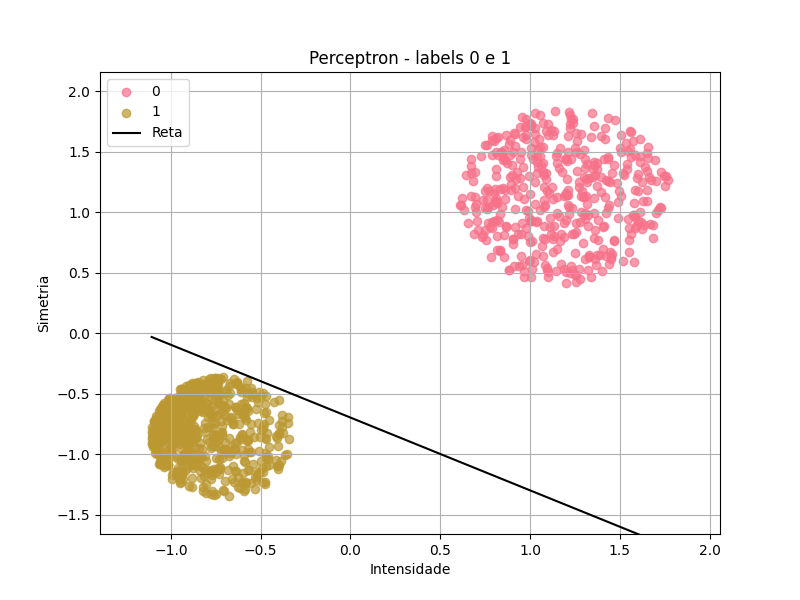
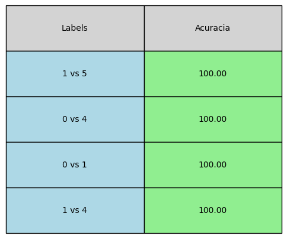
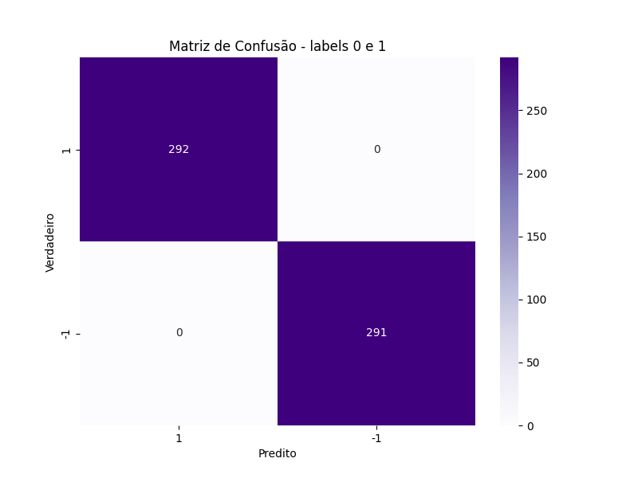
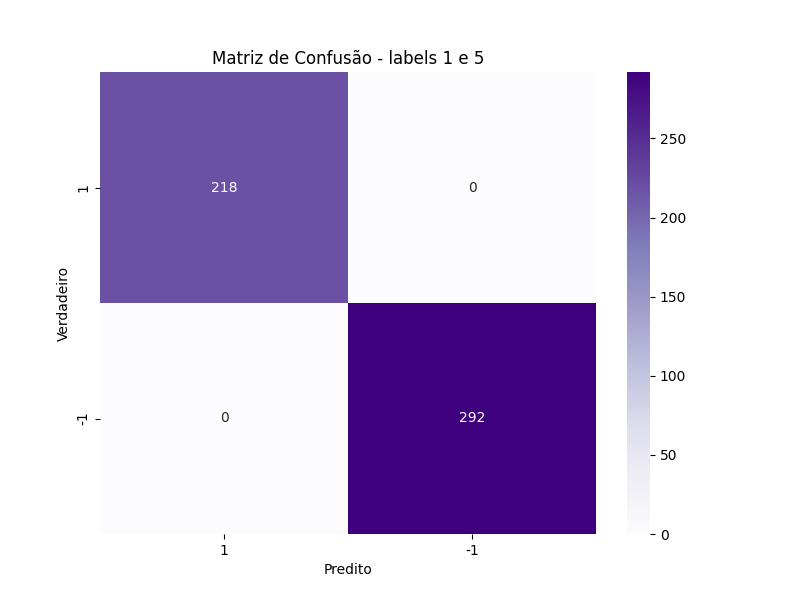
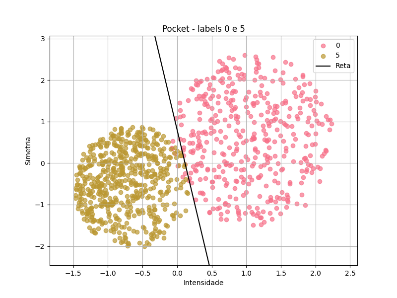
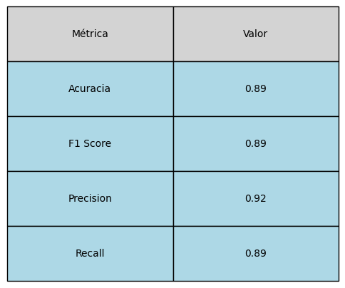

# **Mini-Projeto** - Reconhecimento de Dígitos
### Aluno: Thiago Rodrigues Cruz Justino
### Professores: Giberto Farias e Bruno Jefferson de Sousa

Inicialmente, é realizado o tratamento dos arquivos encontrados na pasta data, que contém [train.csv](data/train.csv) e [test.csv](data/train.csv). Esses arquivos possuem a primeira coluna como o rótulo (0, 1, 4 ou 5) e as 784 colunas restantes representando os valores dos pixels, que variam de 0 a 255. Para simplificar o problema, que originalmente possui 784 dimensões, são criadas duas novas colunas: simetria (a soma da simetria horizontal e vertical) e intensidade. Essas novas características são usadas no lugar dos valores dos pixels. Embora essa abordagem resulte em uma perda de informação, ela reduz a dimensionalidade do problema e o torna mais visualizável graficamente, uma vez que agora são utilizadas apenas duas "features". As novas tabelas foram salvos em [test_redu.csv](data/teste_redu.csv) e [train_redu.csv](data/train_redu.csv). Abaixo está uma imagem do gráfico que mostra as labels e seus respectivos pontos utilizando intensidade e simetria.
#### Plot dos dados:

No arquivo [funcs.py](funcs.py)
 está presente os códigos de Regressão linear, PLA, Pocket e Regressão logistica. Abaixo estão os plots obtidos comparando 1 a 1 (no caso do PLA, nem sempre será possível ser utilizado, pois os dados não são linearmente separáveis). E importante destacar que foram feitas adapções como transformar as labels em 1 e -1 para conseguir calcular. Essas informações estão presentes no arquivo [codes.ipynb](codes.ipynb).

### Regressão linear
Bom, regressão linear, de forma simplificada e informal, é como tentar traçar uma reta ou um plano que represente a trajetória e o comportamento dos dados. Ela utiliza a função de diferença quadrática para ajustar os pesos em cada iteração, buscando se aproximar dos valores reais dos dados. A ideia principal da regressão linear não é para classificação, mas, em alguns casos, ela pode oferecer uma boa aproximação de uma reta que separa dados de classes diferentes, como é o caso dos dados desse projeto. Para fazer essa classificação assim como no Perceptron foi utilizado a função sign para saber como classificar os dados.

#### Plots - Regressão linear 1 x 1:
 
 
 
 
 
 
#### Acurácia - Regressão linear:
 
#### Matrizes confusão - Regressão Linear

### Perceptron e Pocket

Após a regressão linear, iniciou-se a análise 1 a 1 utilizando o Perceptron. É importante destacar que não é possível usar o Perceptron em todos os casos, pois nem sempre os dados são linearmente separáveis. Uma adaptação feita para melhorar o desempenho foi iniciar o vetor W com os valores obtidos na regressão linear, o que fez com que, em alguns casos, nem fossem necessárias novas iterações (já que a reta já separava os dados), tornando o processo muito mais rápido. Obs: o primeiro exemplo não utilizou o W da regressão linear justamente para que a diferença fosse observada; ao utilizar o W obtido na regressão linear, percebeu-se que o número de iterações sem esse W era milhares de vezes maior. Além disso, notou-se um comportamento diferente na reta ao longo do processo.

Mas como funciona o Perceptron? Ele tem uma ideia simples: assumindo X como um vetor de features, pegamos um vetor W (vetor de pesos) e calculamos o produto interno dele com o vetor [1, X], sendo o 1 adicionado para o bias, permitindo a translocação da reta ou hiperplano. Feito esse cálculo, aplicamos a função sign, que dará a classificação 1 ou -1. No dataset, temos os valores previstos, então vamos modificando o vetor W até que sign(W * X) produza o valor previsto no dataset.

O algoritmo do Perceptron entra em loop caso os dados não sejam linearmente separáveis, por isso, nesses casos se utiliza o Pocket, o qual faz um número finito de iterações e retorna o melhor W encontrado.

#### Plots - Perceptron 1 x 1:

#### Acurácia - Perceptron:
 
#### Matrizes confusão Perceptron:

#### Plots - Pocket 1 x 1

#### Acurácia do Pocket:

#### Matrizes confusão Pocket:

### Regressão logística

  A fórmula abaixo é da função logística. Basicamente, ela é a nossa função-alvo, a qual que queremos nos aproximar. O 's' é o produto interno do vetor 'x' (as features) com o vetor de pesos 'w', que será ajustado a cada iteração no algoritmo de aprendizado. A ideia é que, a cada iteração, mudamos o 'w' e ele vai se aproximando cada vez mais dessa função. Até aí, tudo tranquilo, né?

Aí você pode se perguntar: "Mas por que fazer isso?" Então, se você reparar, os valores que essa função gera ficam entre 0 e 1, o que nos dá uma ideia de probabilidade de pertencimento a uma determinada classe (chamamos essa probabilidade de 'p'). Além disso, temos também a estimativa da probabilidade de pertencer à outra classe, dada por '1-p'. Assim, se tivermos novos 'x' fora do treinamento e fizermos o produto interno com o vetor de pesos, conseguimos uma estimativa da probabilidade de pertencer a uma classe específica.

Feito isso, temos um classificador. Se f(x) for maior que 0,5, é mais provável que o ponto pertença à classe 1 (vamos chamar assim). Se a probabilidade for menor, é mais provável que pertença à classe 2 (porque nesse caso, 1-p > 0,5). No gráfico 3D, o vetor 'x' é bidimensional, por isso a função parece um plano. Mas, se você observar bem, ela mantém o formato(muito visível nas labels 4,5), só que em 3D, o que indica que eu consegui me aproximar da função-alvo.

#### Visualização 3D da Regressão Logística:

[Labels 0,1](https://thiagorcj.github.io/Projeto_ML/logistic_regression_3d_plot_0_1.html) |
[Labels 0,4](https://thiagorcj.github.io/Projeto_ML/logistic_regression_3d_plot_0_4.html) |
[Labels 0,5](https://thiagorcj.github.io/Projeto_ML/logistic_regression_3d_plot_0_5.html) |
[Labels 1,5](https://thiagorcj.github.io/Projeto_ML/logistic_regression_3d_plot_1_5.html) |
[Labels 1,4](https://thiagorcj.github.io/Projeto_ML/logistic_regression_3d_plot_1_4.html) |
[Labels 4,5](https://thiagorcj.github.io/Projeto_ML/logistic_regression_3d_plot_4_5.html) |

#### Acurácia da Regressão logística:
 

#### Matrizes confusão Regressão logística:

### Classificador com multiplas classes com ideia de "1 contra todos" - Regressão linear

Gif com os processos detalhados para classificação:

Métricas:

Matriz confusão:

